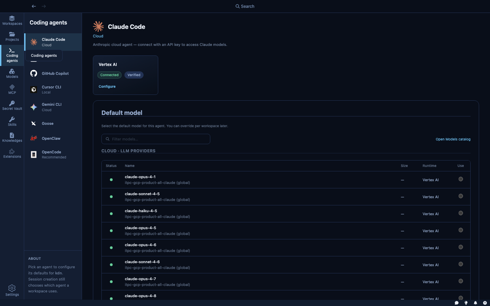

AI coding agents are powerful — but running them directly on your machine means they operate with your full user permissions, your credentials, and unrestricted access to your filesystem and network. Kaiden changes that: every agent runs inside a secured sandbox, so you get the productivity benefits without the risk.

Running an agent through Kaiden means:
- The agent can only touch the project directory you shared with it
- Your API keys are injected automatically — the agent never sees them
- Network access is limited to the services you've explicitly allowed
- Everything the agent does is logged and visible in the dashboard

You keep full control of what the agent can reach, while the agent keeps full autonomy to do its job.

The **Coding Agents** section is where you manage which agents are available in Kaiden and configure their defaults. Currently, the primary configuration is setting the **default model** for each agent — the model that will be pre-selected whenever you create a new sandbox with that agent.

---

## Available agents

| Agent | Strength |
|---|---|
| **Claude Code** | Long-context reasoning, large codebase analysis, refactoring |
| **Goose** | Open-source, extensible via plugins, broad tool support |
| **Cursor CLI** | Familiar to Cursor editor users, strong inline editing model |
| **GitHub Copilot** | GitHub-native workflows, PR review, issue-to-code tasks |
| **Codex** | Fast code generation and completion |
| **OpenCode** | Lightweight open-source option, community-maintained |
| **OpenClaw** | Autonomous task execution, works with local and cloud models |
| **Gemini CLI** | Multimodal input, strong at Google ecosystem tasks |

Click an agent's name to open its settings panel.

---

## Per-agent settings

**Default model** — the model pre-selected for this agent when creating a new sandbox. For Claude Code, for example, you might set `claude-sonnet-4-6` as the default for everyday tasks. The model can always be changed at sandbox creation time.

---

## Switching agents

Agents are per-sandbox. To use a different agent on the same codebase, create a new sandbox pointing to the same folder and pick the other agent. Both sandboxes can run simultaneously if you want to compare outputs.
