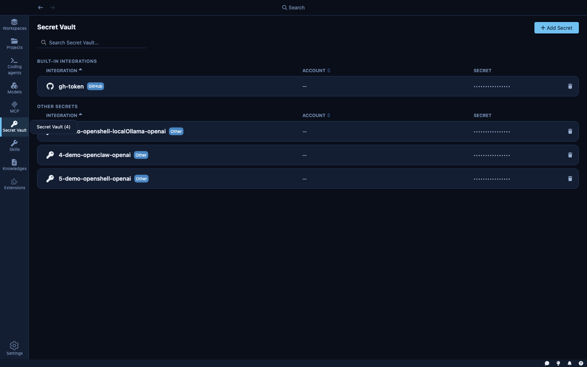
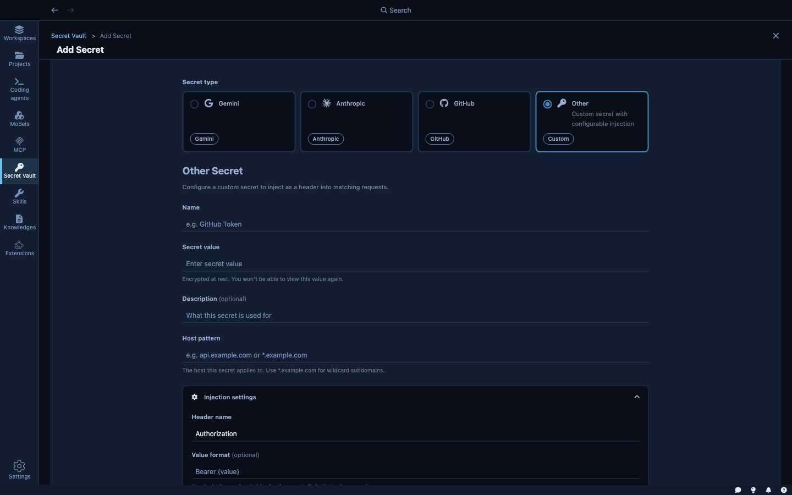

The **Secret Vault** is where you store every credential Kaiden needs to give your sandboxes authenticated access to external services.

---

## How the secret store works

Kaiden splits each credential into two parts stored separately:

- **Metadata** — the name, host patterns, header format, and other configuration is stored in a local file (`~/.kdn/secrets.json`). This file never contains the actual secret value.
- **Secret value** — the credential itself is stored exclusively in your **OS credential vault**: macOS Keychain, Windows Credential Manager, or Linux Secret Service. Kaiden never writes the value to disk itself.

This means your credentials are protected by the same mechanism that protects your SSH keys, browser passwords, and system credentials — the OS's own secure storage, with access controlled by your user session. Even if someone reads the `secrets.json` file, they only see metadata.

---

## How credentials reach the agent

When you attach a credential to a sandbox, Kaiden does three things automatically:

1. **Fetches the value from the OS credential vault** and creates a provider in the sandbox runtime. The agent can call the service as if it were authenticated — without ever seeing the actual key.
2. **Adds the service's hosts** to the sandbox's network allow-list. You get access to exactly the right hosts, no more.
3. **Injects the credential** as the appropriate HTTP header when the agent makes requests to those hosts. For GitHub, that's `Authorization: Bearer <token>`. For custom secrets, you define the format.

You don't write config files. You don't set environment variables. You pick the credential in the wizard; the rest is automatic.

---

## Built-in integrations

Kaiden ships with a pre-configured integration for **GitHub**. It knows GitHub's host patterns and authentication format — you provide your personal access token, Kaiden handles the rest.

| Integration | What it grants access to |
|---|---|
| GitHub | `api.github.com`, `github.com` |

More built-in integrations are planned for future releases. For any service not yet covered, use a generic secret (see below).

---

## Adding a secret

Click **+ Add secret** from the Secret Vault to open the add form.

**Name** — a label for this credential (e.g., `my-github-token`, `staging-api-key`).

**Value** — the actual secret. Encrypted immediately on entry; never shown again in plaintext.

**Host pattern** — which hosts this credential applies to. Examples:
- `api.github.com` — exact host
- `*.mycompany.com` — any subdomain
- `staging.api.example.com:8443` — host with port

**Injection settings:**
- **Path pattern** — optional: only inject on URLs matching this path (e.g., `/api/v2/*`)
- **Header name** — the HTTP header to set (default: `Authorization`)
- **Value format** — how to format the token (e.g., `Bearer {value}`, `token {value}`, or just `{value}`)

For a GitHub personal access token, the header is `Authorization` and the format is `Bearer {value}`. Kaiden's built-in GitHub integration sets this automatically; you only fill it in for custom services.

---

## What the agent actually sees

The agent inside the sandbox never sees your credential values. From the agent's perspective:

- Network requests to `api.github.com` just work — the sandbox intercepts them and adds the correct `Authorization` header.
- The credential value is not in any environment variable the agent can print.
- It's not in any file on the sandbox filesystem.

This means that even if the agent is compromised or tricked into leaking its environment, your credentials are not exposed.
