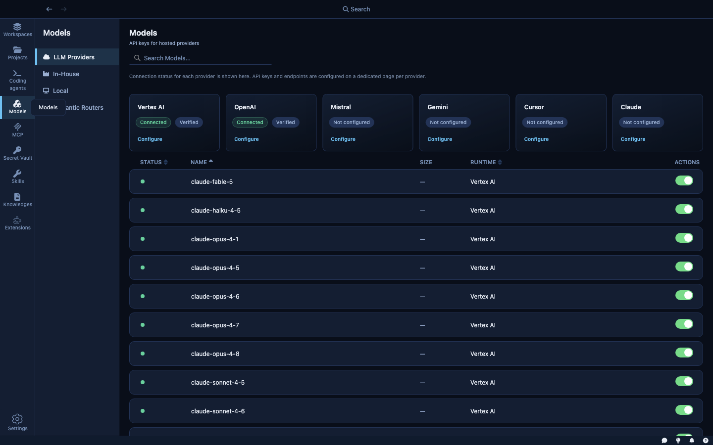
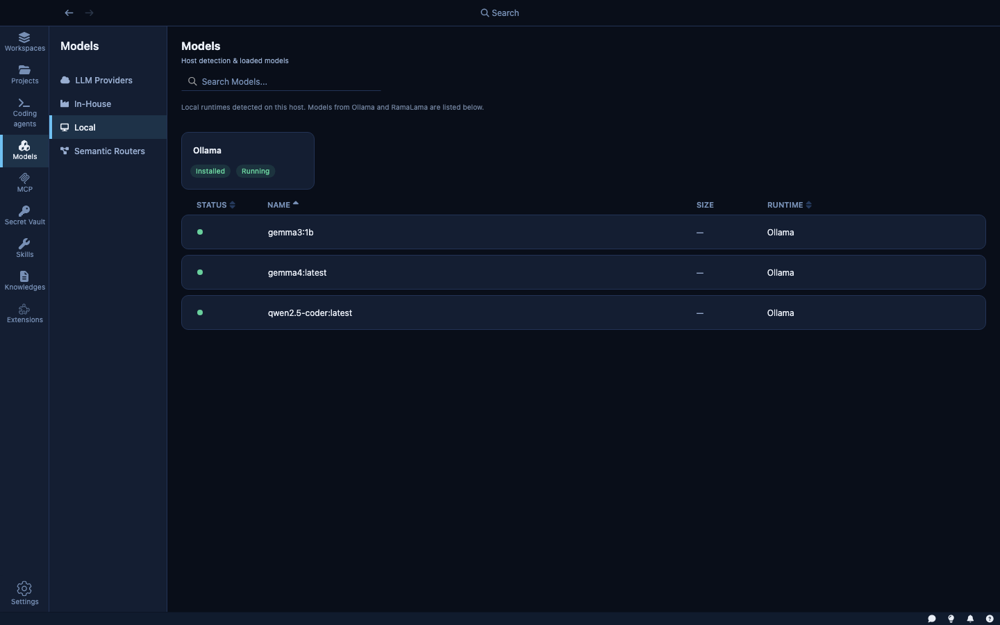
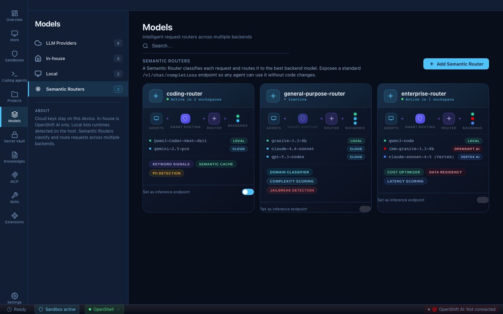

The **Models** section is the single place where you configure every model your coding agents can use. Whether you're running cloud APIs, local models on your laptop, or models hosted on an enterprise cluster — you connect them here once, and every agent across every sandbox can use them.

Kaiden provides ready-to-use integrations for all major model providers. Adding a new provider is a matter of filling in credentials on a card — no config files, no environment variables, no per-agent setup. Once connected, the model appears in the picker for every sandbox you create.

The Models section covers four areas:

- **LLM Providers** — cloud APIs (Claude, Mistral, Gemini, Vertex AI, OpenAI-compatible endpoints)
- **Local** — models running on your machine via Ollama or RamaLama
- **In-house** — models hosted on an enterprise OpenShift AI cluster
- **Semantic Routers** — smart routing rules that direct requests to the right model based on content

---

## LLM Providers

The **LLM Providers** tab shows your connected cloud model services.



Kaiden ships with extensions for the following cloud providers:

| Provider | Type | Notes |
|---|---|---|
| **Claude** | Cloud | Anthropic API. Supports custom base URLs. |
| **Mistral** | Cloud | Mistral API. |
| **Gemini** | Cloud | Google Gemini API. |
| **Vertex AI** | Cloud | Google Cloud — runs Anthropic Claude models (claude-opus-4, claude-sonnet-4, claude-haiku-4) on your GCP project. Authenticates via Application Default Credentials. |
| **OpenAI Compatible** | Cloud / Self-hosted | Any API that speaks the OpenAI protocol — OpenAI itself, Azure OpenAI, or any self-hosted endpoint. Provide a base URL and API key. |

Clicking a provider card opens its configuration: API key, base URL (for OpenAI Compatible and Vertex AI), and which models to make available to agents.

**How model calls are secured:** When an agent inside a sandbox calls an LLM, the request goes through Kaiden's internal routing layer rather than directly to the cloud. Your API key is injected at that layer. The agent makes a standard API call; it never handles the key directly. Rotating a key in the Secret Vault takes effect immediately across all running sandboxes — no restarts needed.

---

## Local Models

The **Local** tab shows AI runtimes running directly on your machine.



Kaiden detects local runtimes automatically — Ollama and RamaLama only appear in this tab if Kaiden can see them running on your machine. If neither is installed, the tab is empty.

**Ollama** — a local model server. When detected and running (shown as `Running · 127.0.0.1:11434`), any model you've pulled in Ollama appears in the model picker for sandboxes. Models run entirely on your machine; no data leaves your network.

**RamaLama** — an open-source local model runner. Shows as `Installed · Not running` when installed but not started. Start it from this panel to make its models available.

The page shows which models are currently loaded in memory with their RAM usage. Large models require significant VRAM; Kaiden shows you what's loaded so you can manage memory.

To use a local model in a sandbox, select it in Step 2 of the wizard. Model requests from the sandbox are routed to the local server via Kaiden's secure routing layer — the agent cannot call arbitrary local ports directly.

---

## In-house Models

The **In-house** tab connects Kaiden to models running inside your organization's infrastructure — never leaving your network, managed by your own team.

This is the enterprise path: models deployed and approved by your organization's data science team, running inside your cluster, with full data residency guarantees.

**OpenShift AI** is the in-house provider supported today. More enterprise model platforms will be added in future releases.

To connect to OpenShift AI:
1. Enter your **Cluster API URL** (e.g., `https://api.openshift.corp.example:6443`)
2. Enter your **OpenShift token** (an OAuth token or service account token with model-serving access)
3. Click **Save & sync models**

Once connected, approved models appear in the list. Models marked **pending approval** are visible but not yet selectable — your organization's admin controls which models agents can use.

---

## Semantic Routers

The **Semantic Routers** tab is where you configure intelligent routing rules that direct model requests to the right backend based on the content of each request.



Kaiden integrates with [vLLM Semantic Router](https://developers.redhat.com/articles/2026/03/25/getting-started-vllm-semantic-router-athena-release), an open-source routing layer that sits between your agents and your model backends. It speaks the standard OpenAI API — agents send requests with `"model": "auto"` and the router decides which backend handles them. No agent code changes required.

### Why it matters

AI coding agents generate large volumes of model calls, and not all of them need the same model. A routine code completion doesn't need the same capability — or the same cost — as a complex architectural analysis. Without a router, every request goes to the same model regardless.

With a semantic router you can, for example:
- Send simple tasks to a local model (free, private, instant)
- Send complex reasoning to a powerful cloud model (only when needed)
- Block requests that trigger jailbreak or PII classifiers before they reach any backend

The result: lower cost, better data residency, and a safety layer — without changing how agents work.

### How a router is built

A router has two building blocks: **signals** and **decisions**.

**Signals** detect patterns in incoming requests. The most common type is a keyword signal:

```yaml
signals:
  keywords:
    - name: "coding_keywords"
      operator: "OR"
      keywords: ["implement", "refactor", "debug", "function", "class"]
      case_sensitive: false
```

Advanced signal types include embedding similarity (semantic matching to anchor prompts), domain classification via neural classifiers, and request complexity scoring.

**Decisions** consume signals and select a backend. Priority controls evaluation order:

```yaml
decisions:
  - name: "coding-route"
    priority: 80
    rules:
      operator: "OR"
      conditions:
        - type: "keyword"
          name: "coding_keywords"
    modelRefs:
      - model: "mlx-community/Qwen3-Coder-Next-4bit"
  - name: "default-route"
    priority: 1
    rules:
      operator: "AND"
      conditions: []
    modelRefs:
      - model: "gemini-2.5-pro"
```

Routers are configured as YAML directly in Kaiden and applied to sandboxes from the router card. A sandbox with an active router shows **Smart routing active** in the sandbox list.
