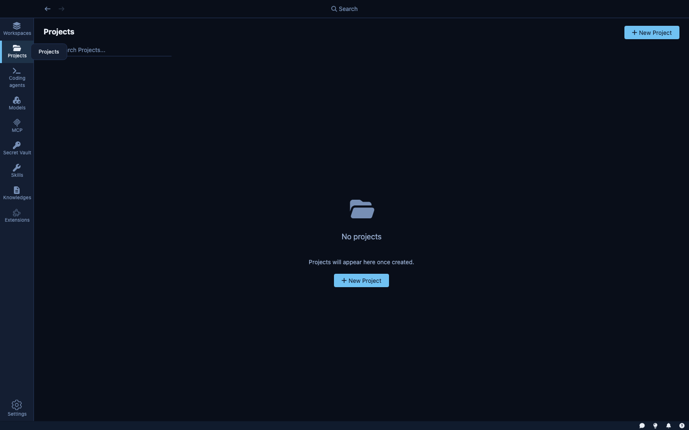

A **project** is a codebase and its configuration. It captures the working directory, which credentials are available, what the network policy allows, and which skills, MCP servers, and knowledge bases the agent should use. Everything you configure at the project level is inherited by every sandbox and session you create under it.

---

## What a project stores

| Field | Description |
|---|---|
| **Name** | A human-readable label; also used as the project's unique ID |
| **Description** | Optional summary of what the project is for |
| **Folder** | Local path to the codebase on your machine |
| **Secrets** | Which credentials from the Secret Vault are available inside sandboxes |
| **Skills** | Which skills are attached by default |
| **MCP Servers** | Which MCP servers are enabled by default |
| **Knowledge Bases** | Which knowledge bases the agent can search |
| **Network policy** | Which hosts sandboxes can reach |
| **Filesystem config** | Which parts of the local filesystem are accessible inside the sandbox |

Projects are stored as individual JSON files in Kaiden's data directory — one file per project, named after the project ID.

---

## Creating a project

Click **+ New Project** from the Projects view. Kaiden offers two flows:

**From an existing local folder** — point Kaiden at a directory on your machine. Kaiden reads the folder name, detects the git remote URL and current branch, and pre-fills the project name and description. You review and save.

**From a git URL** — provide a repository URL and a target path. Kaiden clones the repository, then runs the same analysis: folder name, git remote, branch. Once cloned, you configure the rest of the project (credentials, skills, etc.) and save.

After creation, you can update any field — name, description, attached secrets, skills, MCP servers, knowledge bases, and network rules — from the project detail page.

---

## Reference validation

Kaiden validates that every skill, MCP server, secret, and knowledge base you attach to a project actually exists. If you delete a skill or revoke a secret, Kaiden automatically removes it from any projects that referenced it. Projects never silently reference things that are no longer there.

---

## Network policy

The project's network policy defines which hosts sandboxes can reach.

### How host access is granted

Hosts are added to the allow list in two ways:

1. **Via a credential** — when you attach a secret to the project, the hosts that credential covers (e.g., `api.github.com` for a GitHub token) are automatically added to the allow list.
2. **Via a manual rule** — you can add any host explicitly in the project's Network Policy settings.

### Isolation levels

**Standard** — sandboxes can reach hosts covered by attached credentials plus any manually listed hosts. This is the right default for most projects.

**Strict** — only the explicitly listed hosts. Everything else is blocked. Use for projects where you want to enumerate exactly what the agent can reach.

---

## The three layers

Kaiden organises work in three layers:

| Layer | What it is | Where to find it |
|---|---|---|
| **Project** | A codebase and its configuration — credentials, network rules, skills | Projects view |
| **Sandbox** | A secured, persistent environment for a project — one sandbox can run many sessions | Sandboxes view |
| **Session** | One agent run with a goal, inside a sandbox | Work view |

A project is a template. A sandbox is a persistent environment created from that template — it can be stopped and restarted without losing configuration. A session is an ephemeral agent run inside that sandbox.

| | Project | Sandbox | Session |
|---|---|---|---|
| Lifespan | Permanent | Persistent (stopped, not deleted) | Ephemeral |
| Purpose | Codebase config and defaults | Isolated runtime environment | One agent task |
| Network rules | Defines the policy | Inherits from project | Inherits from sandbox |
| Credentials | Defines defaults | Selected at creation | Inherits from sandbox |
| Lives in sidebar | Projects | Sandboxes | Work |
