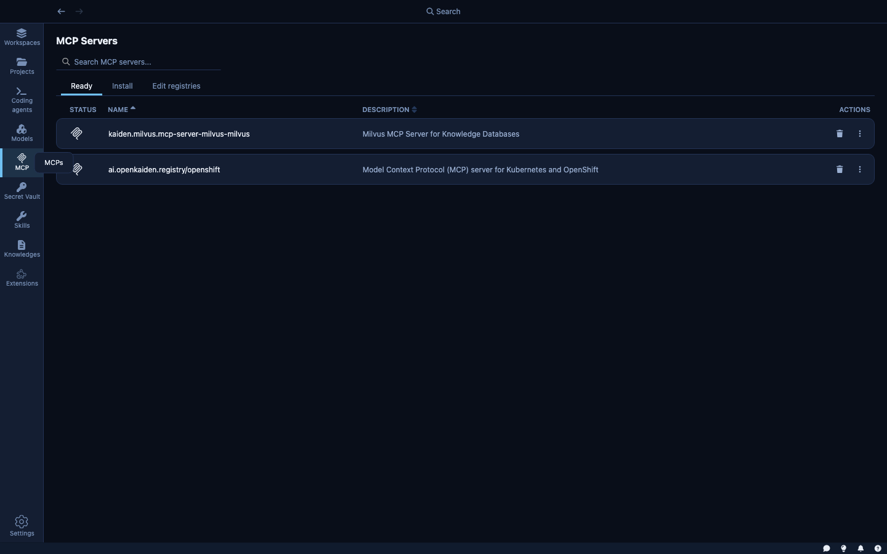
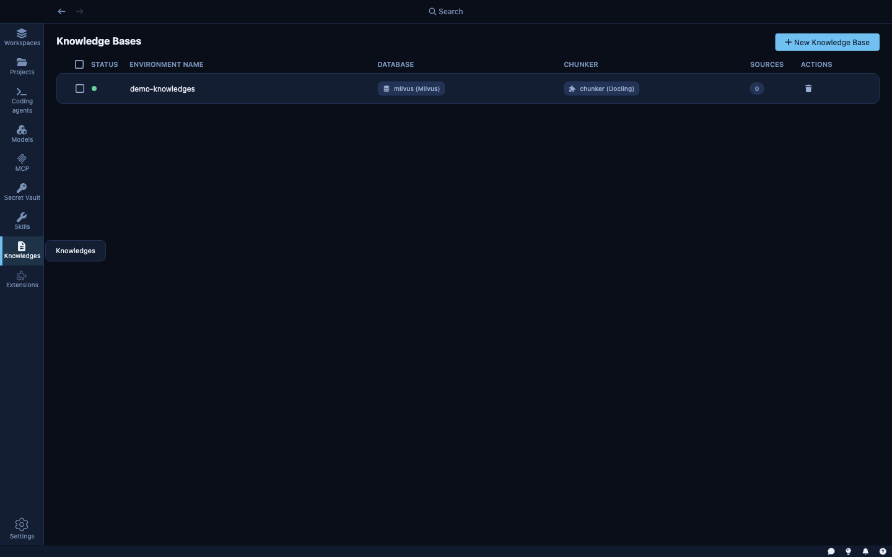

Beyond the AI model itself, Kaiden agents can be equipped with three types of additional capability: **Skills**, **MCP Servers**, and **Knowledge Bases**. Together they determine what the agent knows and what tools it can use.

---

## Agent Skills

**Skills** are instructions you define to give an agent consistent behavior for a specific domain or task type. A skill adds a structured block to the agent's system prompt — describing conventions, constraints, or domain knowledge — so you don't have to repeat the same instructions across every sandbox.

### How skills are discovered

Each skill is a **folder** containing a `SKILL.md` file. Kaiden scans multiple locations at startup to build its skill library:

**Kaiden's own skills directory** — the primary location for skills you create inside Kaiden:

- **Linux**: `~/.local/share/kaiden/skills/`
- **macOS**: `~/Library/Application Support/kaiden/skills/`
- **Windows**: `%APPDATA%\kaiden\skills\`

**Claude Code skills** (`~/.claude/skills/`) — Kaiden's Claude extension automatically scans this directory. Any skills you've already created with Claude Code appear in Kaiden's skill library with a "Claude" badge. No import step needed.

You can also register skills from any other location on your machine — Kaiden stores a reference to the folder path without copying it.

### How skills reach agents inside the sandbox

When you create a sandbox, Kaiden copies the selected skills into the location the agent expects inside the sandbox environment. Each agent has its own conventions:

| Agent | Skills destination (inside sandbox) |
|---|---|
| Claude Code | `~/.claude/skills/` |
| Cursor CLI | `~/.cursor/skills/` |
| Goose | `~/.agents/skills/` |
| GitHub Copilot | `~/.copilot/skills/` |
| Gemini CLI | `~/.gemini/skills/` |
| Codex | `~/.agents/skills/` |

You manage skills in one place in Kaiden; the right files land in the right location for whichever agent is running.

### The SKILL.md format

A `SKILL.md` file has a YAML frontmatter block followed by the skill instructions in plain markdown:

```markdown
---
name: my-skill-name
description: What this skill does (shown in the UI)
---

The instructions injected into the agent's system prompt go here.
You can include conventions, domain knowledge, rules, or any
context the agent should always have when this skill is active.
```

Naming rules (enforced at creation time):
- Lowercase letters, numbers, and hyphens only — e.g. `code-review`, `api-conventions`
- Maximum 64 characters
- Cannot contain `claude` or `anthropic`

### Creating a skill

Click **+ New Skill** from the Skills page to create one through the UI. Kaiden writes the folder and `SKILL.md` into the skills data directory automatically. You can also drop a skill folder directly into the directory or register an external folder path.

Examples of what teams put in skills:
- Coding conventions: "always write tests for new functions", "prefer functional patterns", "never modify lock files"
- Domain knowledge: context about your internal APIs, architecture decisions, or deployment conventions
- Safety rules: "never push directly to main", "always confirm before deleting files"

### Using skills

Once created, a skill can be enabled as a default — meaning every new sandbox automatically gets it — or attached selectively per sandbox at creation time. Skills are cumulative: an agent with multiple skills active gets all of their instructions combined.

---

## MCP Servers

**MCP** (Model Context Protocol) servers are external processes that the agent can call as tools. They extend the agent with capabilities that go beyond text generation — real-time access to systems, APIs, and data sources.



### Default registry

Kaiden ships with a pre-configured MCP registry ([openkaiden/mcp-registry-online](https://github.com/openkaiden/mcp-registry-online)) that makes a curated set of servers available to install immediately. The current registry includes:

| Server | Description |
|---|---|
| **GitHub** | GitHub's official MCP Server |
| **Atlassian** | Connects Jira and Confluence |
| **Fetch** | Fetch and convert web content for LLMs |
| **Grafana** | Grafana observability platform |
| **Linux** | Interact with Linux systems remotely |
| **Notion** | Official Notion MCP Server |
| **OpenShift** | Kubernetes and OpenShift cluster operations |
| **Playwright** | Browser automation using accessibility snapshots |
| **Podman** | Container runtime operations (Podman and Docker) |

### Installing MCP servers

The **Install** tab shows MCP servers available from the registry. Select a server, configure any required credentials, and install it. The **Edit registries** tab lets you add private registries — your organization's internal MCP server catalog.

### MCP servers inside the sandbox

MCP servers run inside the sandbox alongside the agent. They inherit the same network policy — an MCP server can only reach the hosts the sandbox allows, using the credentials the sandbox has. This prevents an MCP server from becoming a lateral-movement path: even if a malicious MCP server tries to call an unexpected host, the sandbox blocks it.

---

## Knowledge Bases

**Knowledge Bases** are vector databases that give the agent retrieval memory — documentation, internal wikis, API references, or any corpus of text you want the agent to search.



### Creating a knowledge base

Click **+ New Knowledge Base** to create one. You provide:
- A name and description
- Which database to use (Milvus or ChromaDB)
- Which chunker to use (Docling for PDFs and structured documents, HF Sentence Transformers for prose)
- Source documents (local files, URLs, or a directory)

Kaiden indexes the sources asynchronously. Once indexed, attach the knowledge base to a sandbox so the agent can search it with natural language queries.

### Knowledge bases and the sandbox

When a knowledge base is attached to a sandbox, the agent can search it directly. The search happens through Kaiden's internal routing — the agent doesn't need network access to the database host. The sandbox's network policy doesn't need to be updated to allow the database address.

---

## Combining them

Skills, MCP servers, and knowledge bases compound. For a team working on a Kubernetes-based platform, for example:

- A **skill** encodes your team's conventions — which resources are managed by which team, naming conventions, rollback rules.
- An **MCP server** gives the agent live tools to query the running cluster.
- A **knowledge base** indexes your internal runbooks and architecture docs.

Together, the agent can answer "why is this deployment failing?" by combining its instructions, live cluster state, and your internal documentation — all from inside a secured sandbox.
