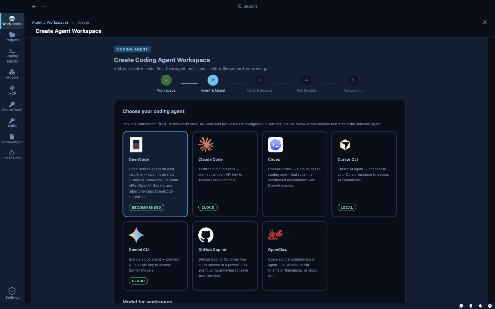
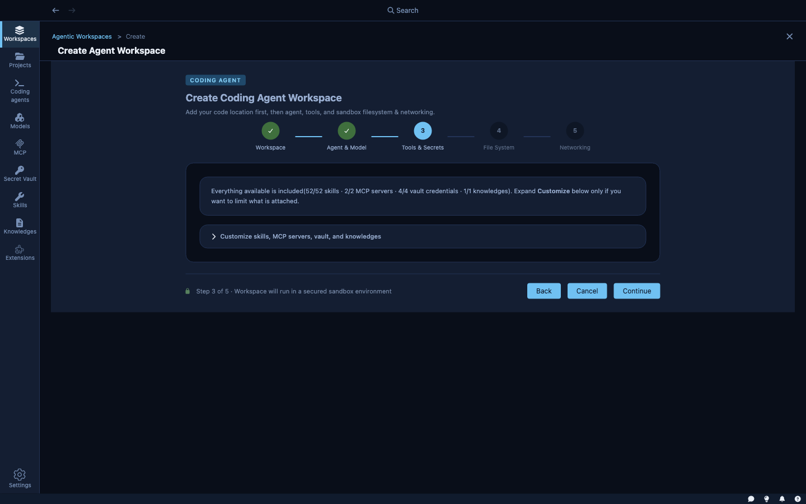
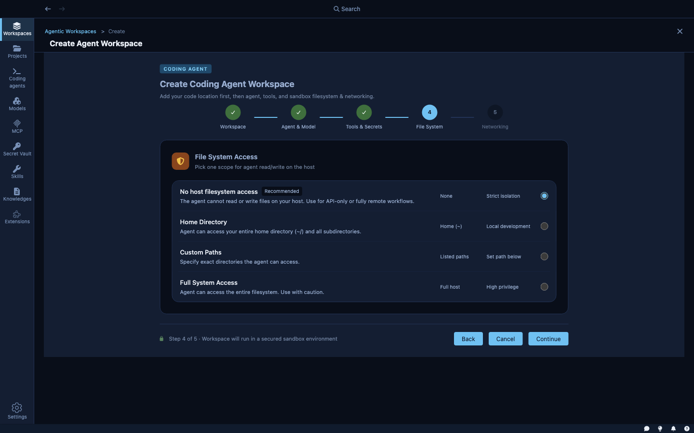
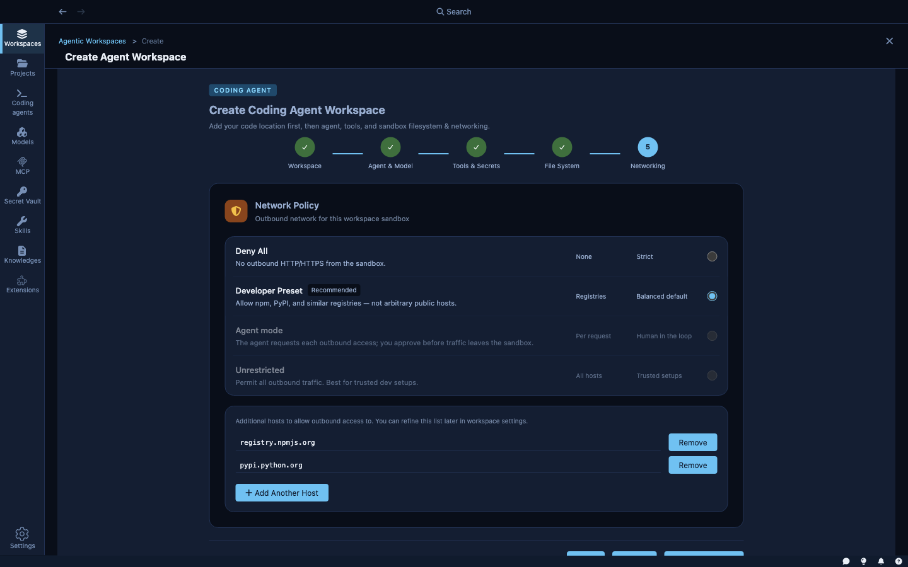
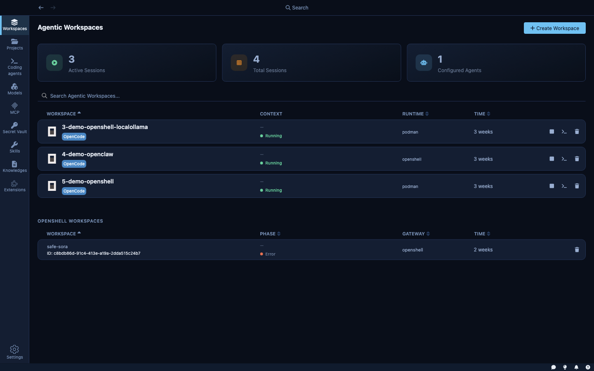

A **sandbox** is the secured, persistent environment where an agent actually runs. It combines a project folder, a chosen agent and model, and a set of policies — what the agent can read on disk, what it can reach on the network, and which credentials it can use.

This page walks through creating your first sandbox and explains the decisions you make along the way.

---

## Sandboxes and projects

Before creating a sandbox, it helps to understand how sandboxes and projects relate.

A **project** is a saved configuration for a codebase. It stores the default credentials, skills, MCP servers, and network rules you want applied to every sandbox created for that codebase. You configure it once.

A **sandbox** is an instance of that configuration — the live, running environment. You create a sandbox pointing at a project folder; the sandbox inherits whatever the project defines. You can create multiple sandboxes for the same codebase (one per agent type, one per experiment) without reconfiguring everything from scratch.

If you don't create a project first, you can still create a sandbox directly from any local folder. Kaiden will configure everything inline.

---

## Creating a sandbox

Click **+ New Workspace** from the Sandboxes view. This opens a five-step wizard. Each step configures one dimension of the sandbox environment.

### Step 1 — Workspace

Point Kaiden at the local folder that contains your codebase.

- **Project folder** — the path to your working directory. Type the path or use the folder picker. The sandbox will only have access to files within the scope you define in step 4.
- **Workspace name** — defaults to the folder name; edit it to distinguish sandboxes for the same project.

**Existing configuration detected.** If the folder already contains a `.kaiden/workspace.json` file (left by a previous sandbox), Kaiden shows three options:
- **Start workspace as-is** — use the existing configuration immediately, skipping the rest of the wizard.
- **Merge with existing** — continue the wizard and merge your new selections with the existing file.
- **Replace existing** — continue the wizard and overwrite the existing configuration.

**Quick create.** On this first step you'll also see a **Use all defaults and create workspace** button. This skips the remaining steps and creates the sandbox immediately using your configured defaults — useful if you've already set a default agent and model in [AI Agents](ai-agents).

### Step 2 — Agent & Model

Choose which coding agent runs in this sandbox and which model it should use.

- **Agent** — the coding assistant: Claude Code, Goose, Cursor CLI, and so on. Each agent has its own CLI and reasoning style.
- **Model** — the LLM the agent calls to generate responses. The model list shows only models you have a working connection for (configured in [Models & Inference](models-and-inference)).

You can set a default agent and model in **AI Agents** so this step is pre-filled every time.

### Step 3 — Tools & Secrets

Equip the agent with capabilities and credentials.

- **Skills** — instruction sets injected into the agent's system prompt. Select from the skills you've created in [Skills, MCP & Knowledge Bases](skills-mcp-knowledge).
- **MCP servers** — external tool servers the agent can call. Select from installed MCP servers.
- **Secrets** — credentials from the [Secret Vault](credentials-and-secrets). Attaching a secret automatically adds its host to the network allow list and injects the credential at request time. The agent never sees the value.
- **Knowledge bases** — vector databases the agent can search for documentation, runbooks, or API references.

### Step 4 — File System

Choose how much of your host filesystem the agent can access.

| Option | What the agent can access |
|---|---|
| **No host filesystem access** | Only the sandbox environment — no host files at all |
| **Home Directory** | Your entire home directory (`~/`) and all subdirectories |
| **Custom Paths** | Specific directories you list; you control exactly which paths are accessible |
| **Full System Access** | The entire host filesystem — use with caution |

The default is no host filesystem access beyond the project folder. For most coding tasks, the project folder is all the agent needs. Broader access makes sense when the agent needs to read config files, shared libraries, or other directories outside the project.

### Step 5 — Networking

Set the outbound network policy for the sandbox.

| Mode | What it allows |
|---|---|
| **Developer Preset** (recommended) | Package registries — npm, PyPI, and similar. Balanced for most coding tasks |
| **Deny All** | No outbound HTTP/HTTPS. For fully offline or air-gapped tasks |
| **Unrestricted** | All outbound traffic. For trusted environments where you want no restrictions |

Hosts granted by attached secrets (from step 3) are automatically added on top of whatever mode you select. You can also list additional hosts manually.

The network policy can be changed after creation from the sandbox's settings page.

---

## After creation

Once created, the sandbox appears in the **Sandboxes** view. From there you can:

- **Start / stop** the sandbox without losing its configuration
- **Open a terminal** — a full shell inside the running sandbox via `kdn terminal`
- **Browse files** — explore the sandbox filesystem from the Files tab
- **View settings** — update the agent, model, network policy, or mounted paths
- **Start a session** — launch an agent run with a specific goal (see the Work view)

The sandbox persists until you delete it. You can stop it to free resources and restart it later exactly as you left it.

---

## The workspace configuration file

When a sandbox is created, Kaiden writes a `.kaiden/workspace.json` file into the project folder. This file records the sandbox configuration — agent, model, skills, secrets, network rules, and filesystem mounts.

This file travels with the codebase. If you commit it to your repository, teammates can open the same folder and get the same pre-configured sandbox, or start it as-is from the wizard.
